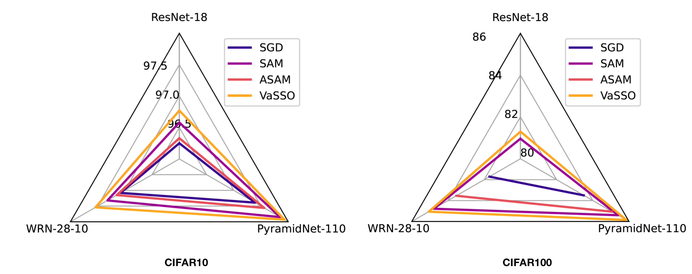

## [NeurIPS 2023] VaSSO: Enhancing Sharpness-Aware Optimization Through Variance Suppression


This repo implements NeurIPS 2023 paper 
["Enhancing Sharpness-Aware Optimization Through Variance Suppression"](https://arxiv.org/abs/2309.15639)
in pytorch. The code is built on top of [this repo](https://github.com/Mi-Peng/Sparse-Sharpness-Aware-Minimization).

VaSSO is a general approach to further improve generalization of sharpness-aware minimization (SAM) for training deep neural networks. 
This is achieved by refined optimization for inner maximization to promote more stable sharpness estimate. 

As an illustrative example, the test accuracy of VaSSO on CIFAR10 and CIFAR100 can be found in the figure below.





### Getting started

- Clone this repo

```bash
git clone https://github.com/BingcongLi/VaSSO.git
cd VaSSO
```


- Create conda environment

```bash
conda create -n vasso python=3.8 -y
conda activate vasso
```

- Install the other dependencies

```bash
conda install pytorch==1.12.1 torchvision==0.13.1 torchaudio==0.12.1 cudatoolkit=11.3 -c pytorch
```

- Dataset preparation

    CIFAR10, CIFAR100 and ImageNet are adopted.

    CIFAR datasets are built-in, and ImageNet can be found [here](http://image-net.org/).

### Useful config

The configs can be found in `configs/default_cfg.py`. Some important ones are listed below.

- `--opt`. The optimizer to use, e.g., `--sgd` for SGD, `--sam-sgd` for SAM with base optimizer SGD, `vasso-adam` for VaSSO with base optimizer ADAM.
- `--dataset`. The dataset for training, choices = [`CIFAR10_cutout`, `CIFAR100_cutout`, `ImageNet_base`].
- `--model`. The model to be trained, e.g., `resnet18`, `wideresnet28x10`.
- `--rho`. The perturbing radius for SAM, e.g., `--rho 0.1`.
- `--theta`. The hyperparameter of moving average for VaSSO, e.g., `--theta 0.9`.

### Training

As an easy start, you can run the command below to train wideresnets.
```
bash train.sh
```

You can also customize the command line. For example, if you hope to train a Resnet18 on CIFAR10 with SGD:

```bash
python train.py --model resnet18 --dataset CIFAR10_cutout --datadir [your path to dataset] --opt sgd --lr 0.05 --weight_decay 5e-4 --seed [how about 3107]
```

Try out a ResNet18 on CIFAR10 trained with VaSSO:

```bash
python train.py --model resnet18 --dataset CIFAR10_cutout --datadir [your path to dataset] --opt vasso-sgd --weight_decay 1e-3  --seed [how about 3107]
```


### Citation

```bash
@inproceedings{li2023enhancing,
  title={Enhancing Sharpness-Aware Optimization Through Variance Suppression},
  author={Li, Bingcong and Giannakis, Georgios B},
  booktitle={Proc. of Neural Information Processing Systems},
  year={2023}
}

```